<div align="center">

# 🥁 入戏潮汕 · Ruxi Chaoshan

**为一场英歌情，赴一程普宁。**

融合**文化对话 Agent、方言语音交互与个性化内容生成**的 AI 数字文旅体验 —— 从定制赴潮路线、识肉知涮、品茶知味，
到生成一份属于自己的潮汕文创，把线上兴趣变成一趟能参与、能带走的旅程。


[🌐 在线体验](https://qiyucai.cn/puninghackathon/) · [🖼️ 完整画廊](docs/GALLERY.md)

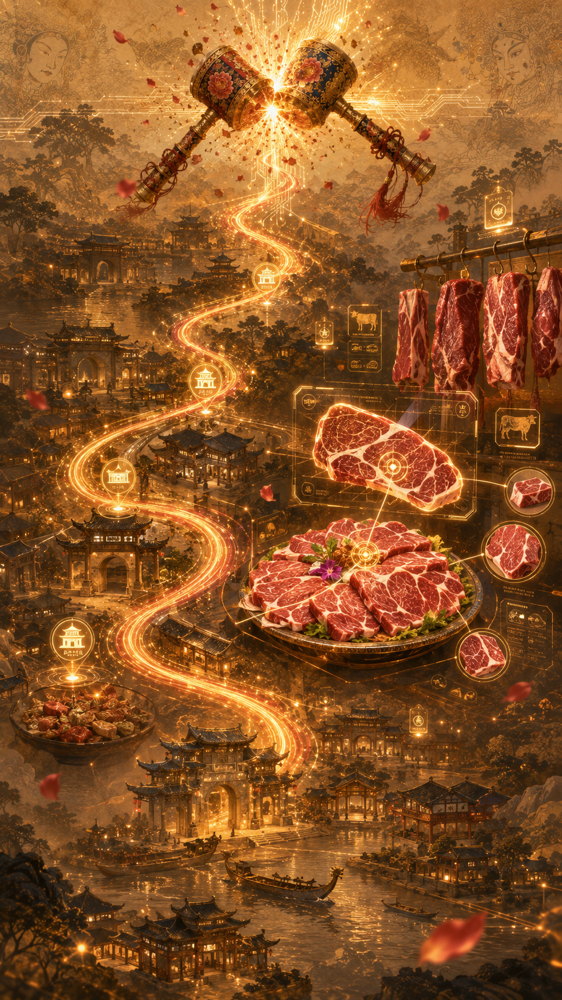

</div>

> 🎲 **普宁黑客松作品** · 面向手机扫码、文旅展台与现场互动的移动端 H5。

产品以 AI 茶师为文化交互核心，串联**语音感知 → 场景理解 → 多轮引导 → 会话记忆 → 个人茶评**。
用户用普通话或潮汕话自然表达，系统把零散感受整理成可理解、可保存的文化体验成果。
英歌情入口、赴潮路线与多主题文创构成产品的进一步扩展方向。

---

## 💡 它解决什么问题

在短视频里看过英歌，想去现场感受一次，却不知道如何把演出、美食和文化体验排成一趟行程。
到了当地，吃过牛肉、喝过工夫茶，又常常说不清其中的讲究，也缺少一份属于自己的旅程纪念。

**入戏潮汕**用一条完整的用户旅程承接这份兴趣：

| 游客的困惑 | 产品的解法 |
| --- | --- |
| 看过英歌，但还没有出行计划 | 用英歌情主视觉与现场体验介绍建立赴普宁的动机 |
| 攻略零散，半天或一天怎么安排？ | 根据兴趣、时长、同行人与到达时间生成路线 |
| 想体验地方文化，却不懂门道 | 用识肉竞猜、蘸碟知识、工夫茶步骤与 AI 茶师引导参与 |
| 旅行结束，只有相似的打卡照 | 把路线与互动结果写进专属侨批和主题海报 |

适合对英歌感兴趣的年轻游客、短途出游的亲友与家庭，也适合文化节、演出展台、茶馆与餐饮门店的扫码互动。

---

## 🧭 一趟旅程，四个环节

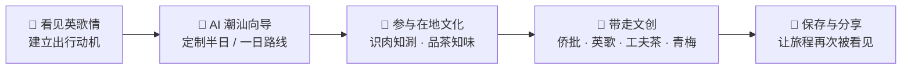

英歌情始终是路线的核心，牛肉火锅、工夫茶、水乡游船、普宁肠粉等体验围绕游客偏好组合。
一次观看由此延伸为路线、互动和个人记忆。

---

## ✨ 核心体验

### 1️⃣ 英歌情 × AI 潮汕向导

**产品扩展设计**：以英歌情为固定核心，将文化兴趣转成普宁半日或一日行程。

以英歌人物、鼓阵、潮汕建筑与红金纸纹建立第一印象，再用明确的入口引导游客定制赴潮路线。
向导结合**选项、对话与语音**收集需求，英歌情固定选中，其余体验自由组合，输出每站的时间、顺序与推荐理由。

<div align="center">
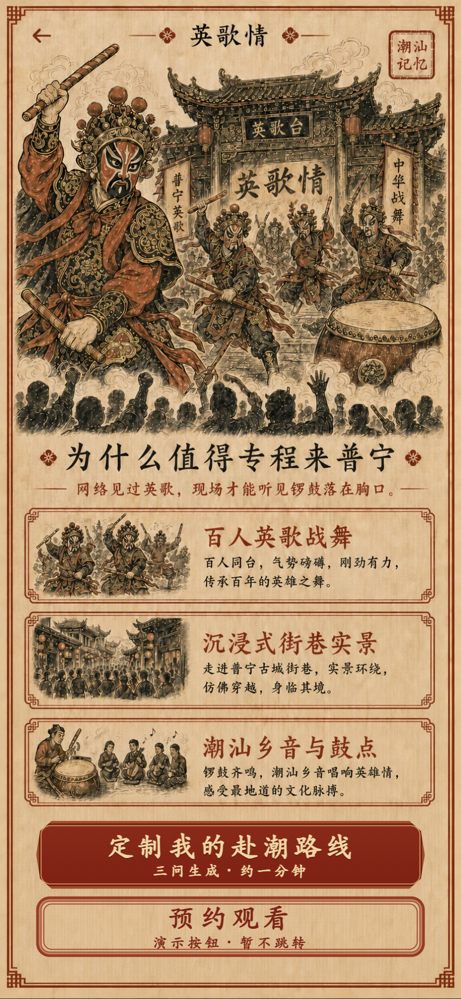
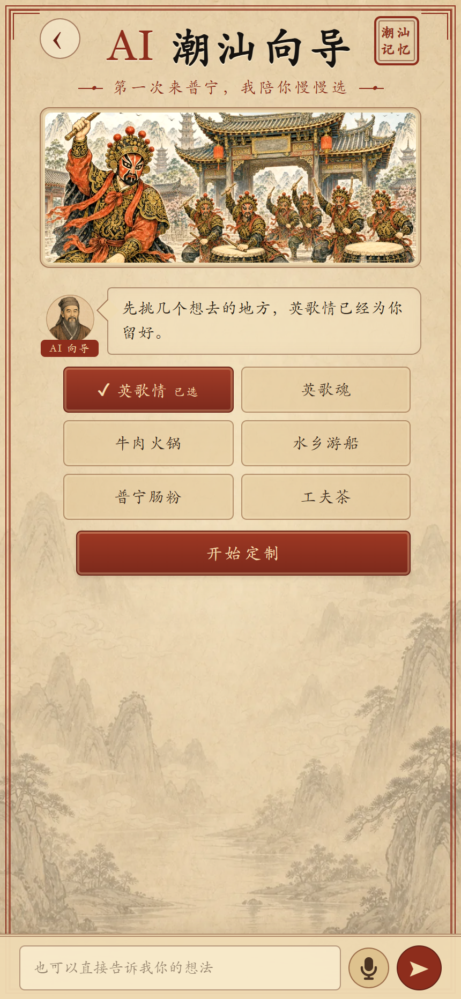
</div>

### 2️⃣ 识肉知涮：把一顿火锅吃明白

观察牛肉图片、竞猜部位，揭晓后学习纹理特征、建议涮煮时间与部位故事。
再通过**汕头沙茶碟与普宁豆酱碟**的并列介绍，了解两种味型与搭配。
无论答对还是答错，都能带走一条用得上的文化知识。

<div align="center">
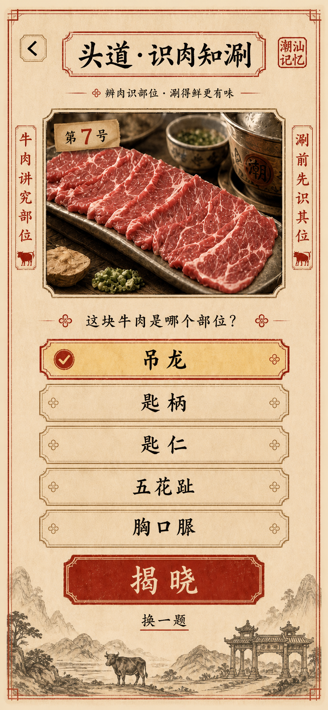
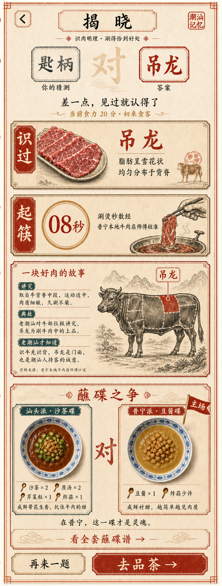
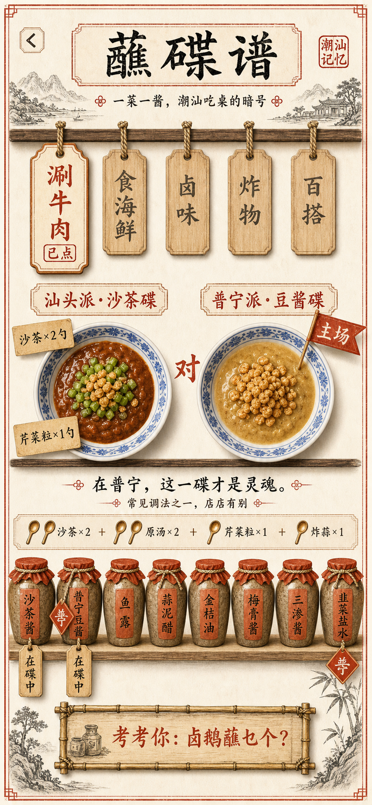
</div>

### 3️⃣ 品茶知味：让“好喝”变成说得出的茶评

**工夫茶八步**解释每一步的动作与原因；**品其味、闻其香、懂其道**三条路径分别引导味觉表达、香气描述与文化问答。
AI 茶师将“很香、嘴里还香”等口语转译为更细致的茶桌语言，并把对话沉淀为个人茶评、关键词与茶客称号。

用户可直接用**普通话或潮汕话**描述感受：语音先转写为文字，再与当前体验模式、对话历史一同交给 AI 茶师。
多轮对话让用户逐步补充“入口甜不甜、是否顺滑、有没有回甘、杯底是否留香”，形成个人茶评所需的信息。

| 体验路径 | 用户输入 | 体验结果 |
| --- | --- | --- |
| 👅 品其味 | 入口、甜度、顺滑、回甘与余味 | 更细致的滋味描述 |
| 🌸 闻其香 | 花香、蜜香、焙火香或自己的联想 | 可学习的香气表达 |
| 📖 懂其道 | 茶名、冲泡方法、茶桌礼仪等问题 | 潮汕茶文化讲解 |
| 🏷️ AI 茶评 | 本轮品茶对话与体验 | 香气 / 滋味 / 口感 / 余韵雷达图、称号与批注 |

<div align="center">
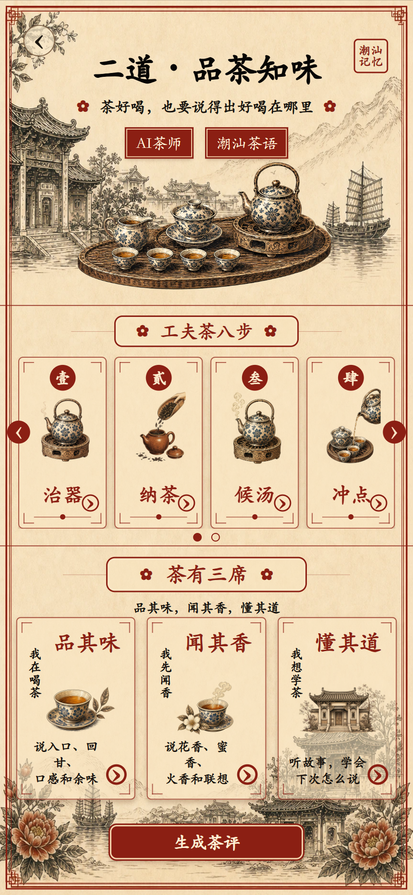
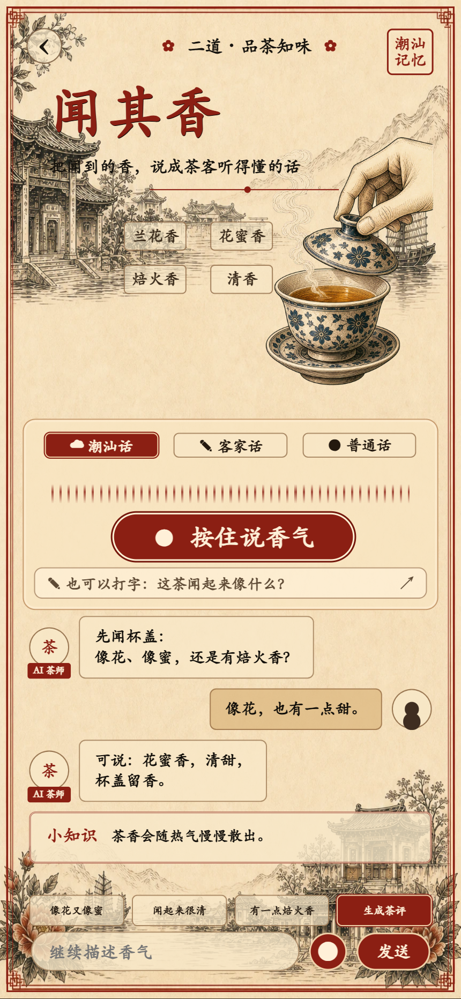
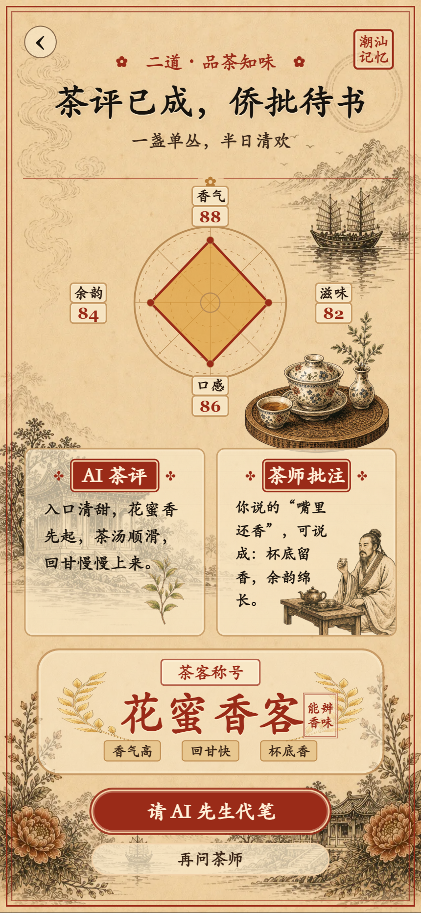
</div>

> 茶评雷达图用于表达个人体验，不作为茶叶品质的专业检测结论。

### 4️⃣ 带走文创：让纪念品写下你的旅程

线上入口为「带走侨批」，产品扩展设计包含以下四种主题。

提供**侨批、英歌、工夫茶、青梅**四种主题。AI 根据路线、同行关系与互动结果生成称号、主题短句与落款，
将个人叙事写入设计好的底图，输出可保存的 PNG 或打印版本。

**固定视觉模板 + AI 个性文案**，让画面风格保持统一，也减少现场等待和实时生图的不确定性。

<div align="center">
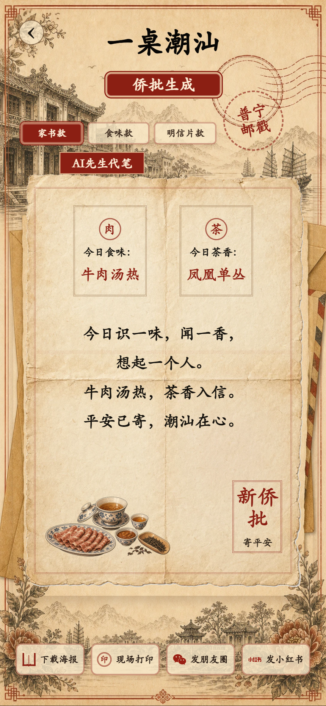
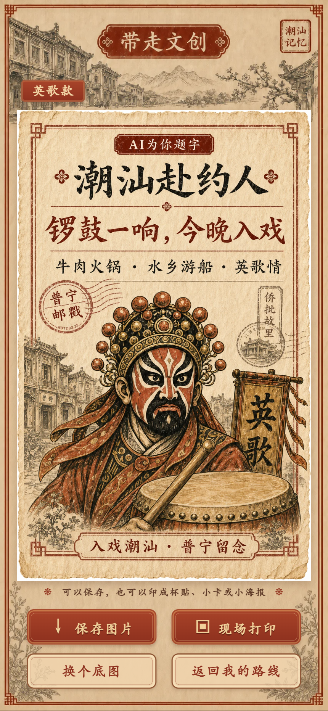
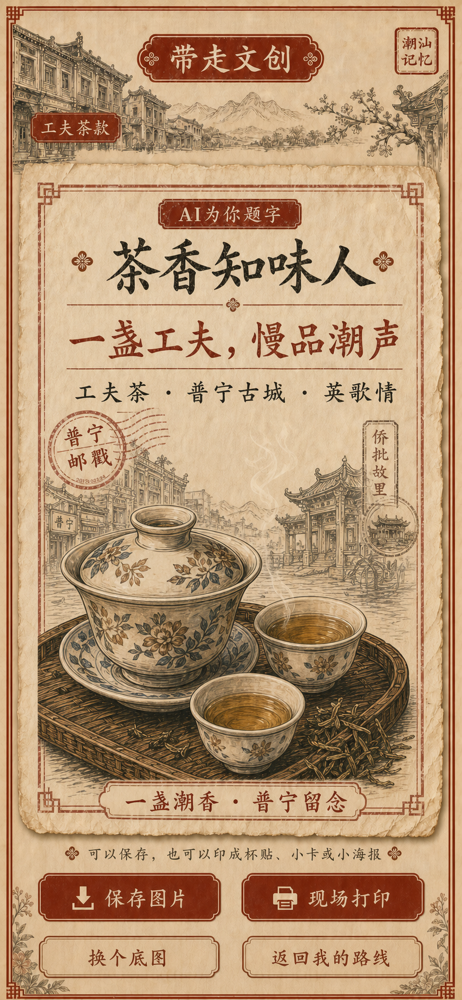
</div>

---

## 🤖 文化对话 Agent：让 AI 成为你的潮汕茶师

产品将 AI 茶师定位为**面向潮汕文化体验的任务型、对话式 Agent**：围绕“理解工夫茶、说清个人感受、形成专属茶评”这一目标，
结合语音输入、场景上下文与会话记忆，在不同体验环节持续提供引导，并将交互内容转成结构化成果。

### 四项核心能力

- 🎙️ **语音感知**：接入普通话与潮汕话实时识别，让游客用熟悉的语言参与。
- 🧠 **场景记忆**：保留各体验分支的对话上下文，支持持续追问与前后衔接。
- 🍵 **任务引导**：按品味、闻香、文化问答和工夫茶步骤提供对应的对话能力。
- 🎴 **成果生成**：将多轮会话汇总为茶评、称号、雷达图与侨批短句，完成体验闭环。

### 场景化对话工作流

对话 Agent 与应用工作流协同：体验页面确定业务模式，语言模型结合问题和历史完成回复，结果生成流程再汇总各分支会话。

| 对话模式 | 任务 | 调用时的上下文 |
| --- | --- | --- |
| `taste` · 品其味 | 引导描述入口、口感与回甘 | 当前问题 + 本席对话历史 |
| `aroma` · 闻其香 | 将口语香气表达转成茶语 | 当前问题 + 本席对话历史 |
| `way` · 懂其道 | 讲解茶文化与饮茶礼仪 | 当前问题 + 本席对话历史 |
| `step` · 工夫茶步骤 | 解释某一步怎么做、为什么这样做 | 步骤编号、名称 + 问题 + 历史 |

**会话记忆**：`taste / aroma / way` 分开存入 `localStorage`，保存时间戳与消息，避免不同体验混在一起。
通过最近消息保留与文本截断管理上下文长度；重新进入页面时恢复相应会话，让体验连续。

**结果生成**：汇总三席会话，调用 `/api/tea-result`，得到茶客称号、茶名、香气描述、茶评、茶师批注、侨批短句和四维雷达分数。
前端对返回值进行字段归一化、文字长度限制与数值校验；缺字段时使用本地结果补齐。

**可靠性处理**：无会话时展示本地结果；接口失败时使用基于会话关键词的规则结果。
雷达分数做有限数检查并限制在 45–98 范围内，避免非法数值破坏图形；对话请求失败时展示错误状态并解除发送中的锁定。

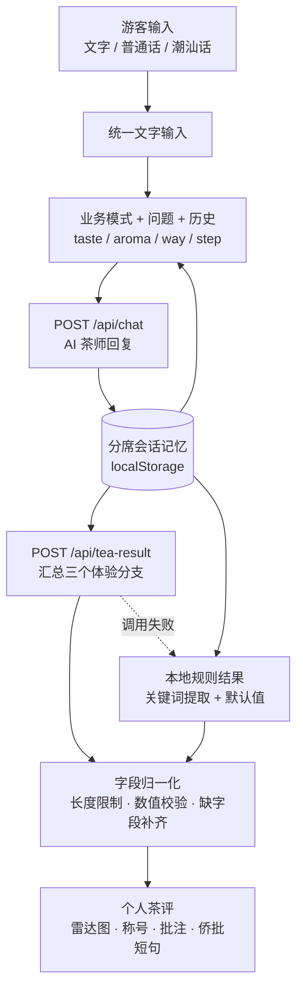

### 从对话到体验成果

文化 Agent 的产品价值在于把一段聊天嵌入真实任务：游客先表达感受，AI 帮助细化与理解，系统记住体验，再生成属于这个人的文化成果。
固定工作流保障体验顺序与结果形式，对话模型提供自然表达和个性化内容；两者共同支撑现场可用的文化交互。

---

## 🎙️ 普通话与潮汕话实时语音识别

语音输入使用**腾讯云实时 ASR**。线上配置接口返回的引擎为 `16k_zh_en`，该引擎支持普通话与潮汕话；
方言能力来自云端识别引擎，前端负责音频采集、流式传输、转写结果合并以及与茶师对话的衔接。
腾讯云的[产品动态](https://cloud.tencent.com/document/product/1093/46797)记录了该实时引擎对潮汕话的支持。

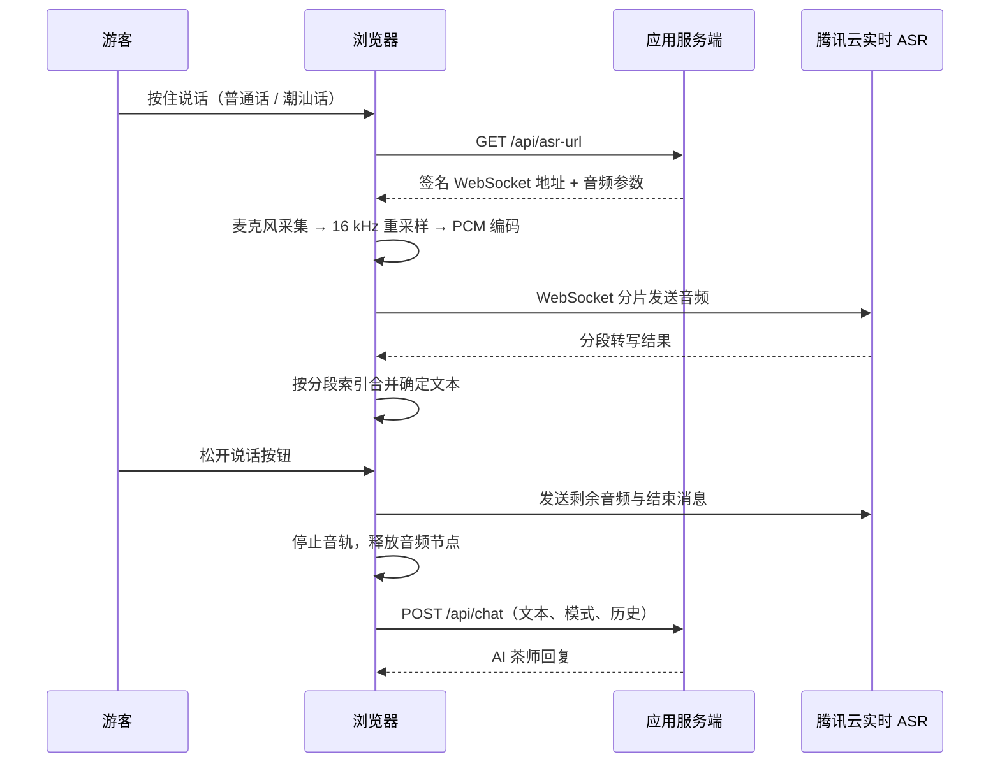

| 环节 | 线上实现 |
| --- | --- |
| 麦克风采集 | `getUserMedia`，单声道，启用回声消除、降噪与自动增益 |
| 音频处理 | Web Audio API 采集 Float32 音频，线性重采样至 16 kHz |
| 编码与分片 | 转换为 16-bit 小端 PCM；配置分片大小为 6400 字节，对应 200 ms 音频 |
| 连接配置 | 应用服务端提供签名 WebSocket 地址、引擎、采样率、分片大小及过期时间 |
| 转写合并 | 按 `index` 保存确定分段，对分段排序后拼接，避免后续结果重复覆盖 |
| 录音结束 | 刷出剩余 PCM、发送结束消息、停止音轨并关闭音频上下文 |
| 交互反馈 | 区分连接中、录音中、识别中与麦克风不可用等状态，支持文字对话入口 |

普通话与潮汕话共用同一混合识别引擎，不要求游客切换两套录音流程。
当前展示的是已接入的识别能力；不同口音与现场噪声下的识别准确率仍需通过真实语音样本评估。

---

## 🧭 路线与文创的扩展设计

路线采用**人工核验数据 + 规则编排 + AI 表达**的分层方案：人工数据提供地点与文化事实；
规则保障英歌情必选、节点合法、时间顺序稳定；AI 生成路线名称、每站理由与行程说明。
计划在模型或网络不可用时回退到预设半日 / 一日路线。

文创延续相同思路：使用侨批、英歌、工夫茶、青梅四种固定主题模板，将路线、同行关系与互动结果转成个性标题、短句和落款。
这些扩展围绕游客的一次完整旅程设计，尚不作为当前线上 MVP 已全部上线的能力。

---

## 🛠️ 技术方案

| 模块 | 方案 |
| --- | --- |
| 线上前端 | React 单页应用，按 Hash 路由切换文化体验页面；静态构建产物部署于子路径 |
| 视觉设计 | 红金纸纹、国风插画、印章与竖屏布局 |
| 文化对话 Agent | 任务目标 + 业务模式 + 多轮上下文，提供茶文化讲解与体验引导 |
| 会话状态 | `localStorage` 分席记忆、消息过滤与截断、体验进度保存 |
| 语音识别 | 腾讯云 `16k_zh_en` 实时 ASR，支持普通话与潮汕话 |
| 音频管线 | Web Audio API + 16 kHz 重采样 + 16-bit PCM + WebSocket 分片传输 |
| 茶评生成 | `/api/tea-result` 汇总会话；前端字段归一化、数值校验与规则兜底 |
| 路线扩展 | 人工核验节点 + 规则编排 + AI 行程表达 |
| 文创扩展 | 固定主题底图与个性文字组合，设计保存 / 打印出口 |

技术介绍围绕产品能力与系统分工展开。对话 Agent 采用场景化工作流组织，路线与文创沿用数据、规则和生成模型分层协作的设计。

---

## 🌐 在线体验

👉 **[打开 Demo](https://qiyucai.cn/puninghackathon/)**（建议使用手机或浏览器移动端模式）

当前线上首页仍使用早期名称**「一桌潮汕」**，提供「识肉知涮」「品茶知味」「带走侨批」入口。
本 README 同时展示**线上文化体验 MVP**与**《入戏潮汕》扩展设计**。英歌情入口、AI 赴潮路线和多主题文创图用于说明完整产品方向，线上版本可能尚未同步全部内容。

推荐先进入「品茶知味」，浏览工夫茶八步，再选择「品其味 / 闻其香 / 懂其道」，感受从日常表达走向个人茶评的过程。

---

## 🗺️ 后续落地方向

- 🎭 **活动试点**：围绕一场英歌活动，联合餐饮门店与茶馆验证扫码、路线完成和文创生成。
- 📅 **实时供给**：接入演出场次、营业时间、天气与预约余量，动态调整行程。
- 🎟️ **商家联动**：接入导航、预约、优惠券与到店核销，串联真实消费场景。
- 🖨️ **现场文创**：扩展杯贴、小卡、明信片、纪念票根与联名打印模板。
- 📊 **运营后台**：配置体验节点、排期与主题模板，观察匿名的互动和转化统计。
- 🤖 **Agent 能力演进**：引入可调用的场次查询、路线检查与商家信息工具，形成“决策 → 调用 → 校验”的反馈循环；进一步探索向导、茶师与文创角色协作。

以上为后续规划，尚不作为当前 Demo 的已交付能力或商业成果。

---

## 📌 关于本仓库

本仓库仅作**黑客松项目展示**，只发布产品介绍、体验流程、技术方案与视觉素材，**不上传产品源代码、服务端实现与内部提示词**。
产品定位、体验流程、AI 对话、普通话 / 潮汕话语音识别与技术方案均在本 README 中说明，更多界面见[产品画廊](docs/GALLERY.md)。

```text
RuxiChaoshan/
├── README.md           # 项目介绍与在线体验入口
└── docs/
    ├── GALLERY.md       # 完整产品画廊
    └── images/         # 项目说明中的视觉与界面素材
```

---

## 👩‍💻 作者

**马靖怡 (Jingyi Ma)** · 中山大学通信工程硕士在读  
GitHub [@Jingmo35](https://github.com/Jingmo35) ｜ 关注 Agent 开发与算法，热爱黑客松 🚀

---

<div align="center">

🥁 **入戏潮汕** · 让一次普宁之行，被经历、被带走、被再次看见。

</div>
