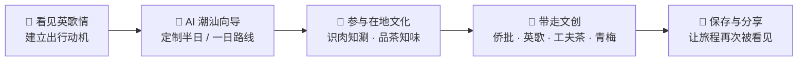
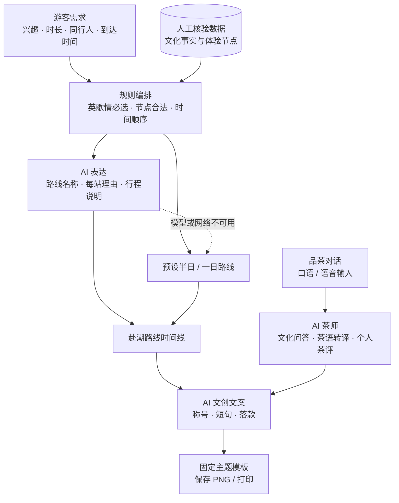

<div align="center">

# 🥁 入戏潮汕 · Ruxi Chaoshan

**为一场英歌情，赴一程普宁。**

以英歌情为文化锚点的 AI 数字文旅体验 —— 从定制赴潮路线、识肉知涮、品茶知味，
到生成一份属于自己的潮汕文创，把线上兴趣变成一趟能参与、能带走的旅程。


[🌐 在线体验](https://qiyucai.cn/puninghackathon/) · [📖 项目说明](https://ocnlp858hvkh.feishu.cn/docx/KkaodY02nonVGhxpYlNcPgBznPg) · [🖼️ 完整画廊](docs/GALLERY.md)


</div>

> 🎲 **普宁黑客松作品** · 面向手机扫码、文旅展台与现场互动的移动端 H5。

---

## 💡 它解决什么问题

在短视频里看过英歌，想去现场感受一次，却不知道如何把演出、美食和文化体验排成一趟行程。
到了当地，吃过牛肉、喝过工夫茶，又常常说不清其中的讲究，也缺少一份属于自己的旅程纪念。

**入戏潮汕**用一条完整的用户旅程承接这份兴趣：

| 游客的困惑 | 产品的解法 |
| --- | --- |
| 看过英歌，但还没有出行计划 | 用英歌情主视觉与现场体验介绍建立赴普宁的动机 |
| 攻略零散，半天或一天怎么安排？ | 根据兴趣、时长、同行人与到达时间生成路线 |
| 想体验地方文化，却不懂门道 | 用识肉竞猜、蘸碟知识、工夫茶步骤与 AI 茶师引导参与 |
| 旅行结束，只有相似的打卡照 | 把路线与互动结果写进专属侨批和主题海报 |

适合对英歌感兴趣的年轻游客、短途出游的亲友与家庭，也适合文化节、演出展台、茶馆与餐饮门店的扫码互动。

---

## 🧭 一趟旅程，四个环节



英歌情始终是路线的核心，牛肉火锅、工夫茶、水乡游船、普宁肠粉等体验围绕游客偏好组合。
一次观看由此延伸为路线、互动和个人记忆。

---

## ✨ 核心体验

### 1️⃣ 英歌情 × AI 潮汕向导

以英歌人物、鼓阵、潮汕建筑与红金纸纹建立第一印象，再用明确的入口引导游客定制赴潮路线。
向导结合**选项、对话与语音**收集需求，英歌情固定选中，其余体验自由组合，输出每站的时间、顺序与推荐理由。

<div align="center">


</div>

### 2️⃣ 识肉知涮：把一顿火锅吃明白

观察牛肉图片、竞猜部位，揭晓后学习纹理特征、建议涮煮时间与部位故事。
再通过**汕头沙茶碟与普宁豆酱碟**的并列介绍，了解两种味型与搭配。
无论答对还是答错，都能带走一条用得上的文化知识。

<div align="center">


</div>

### 3️⃣ 品茶知味：让“好喝”变成说得出的茶评

**工夫茶八步**解释每一步的动作与原因；**品其味、闻其香、懂其道**三条路径分别引导味觉表达、香气描述与文化问答。
AI 茶师将“很香、嘴里还香”等口语转译为更细致的茶桌语言，并把对话沉淀为个人茶评、关键词与茶客称号。

| 体验路径 | 用户输入 | 体验结果 |
| --- | --- | --- |
| 👅 品其味 | 入口、甜度、顺滑、回甘与余味 | 更细致的滋味描述 |
| 🌸 闻其香 | 花香、蜜香、焙火香或自己的联想 | 可学习的香气表达 |
| 📖 懂其道 | 茶名、冲泡方法、茶桌礼仪等问题 | 潮汕茶文化讲解 |
| 🏷️ AI 茶评 | 本轮品茶对话与体验 | 香气 / 滋味 / 口感 / 余韵雷达图、称号与批注 |

<div align="center">


</div>

> 茶评雷达图用于表达个人体验，不作为茶叶品质的专业检测结论。

### 4️⃣ 带走文创：让纪念品写下你的旅程

提供**侨批、英歌、工夫茶、青梅**四种主题。AI 根据路线、同行关系与互动结果生成称号、主题短句与落款，
将个人叙事写入设计好的底图，输出可保存的 PNG 或打印版本。

**固定视觉模板 + AI 个性文案**，让画面风格保持统一，也减少现场等待和实时生图的不确定性。

<div align="center">


</div>

---

## 🤖 AI 如何参与这趟旅程

AI 分别承担**需求理解、路线表达、文化转译与文创写作**，每项能力都对应一个明确的体验结果。
路线采用分层设计：地点与文化事实由人工核验，规则层保障节点与顺序，模型生成自然语言表达。



- **事实有来源**：约束模型使用核验节点，不自由编造商家、票价、场次或菜单。
- **路线有约束**：把英歌情固定为核心，再组合用户选中的体验。
- **失败有兜底**：模型或网络不可用时使用预设路线；语音不可用时保留文字输入。
- **输出可带走**：对话沉淀为茶评与文创，而不仅停留在聊天记录。

---

## 🛠️ 技术方案

| 模块 | 方案 |
| --- | --- |
| 前端 | Vue 3 + Vue Router + Vite，移动端优先的单页应用 |
| 页面组织 | Hash 路由管理文化入口、向导、识肉、品茶与文创页面 |
| 视觉设计 | 红金纸纹、国风插画、印章与竖屏布局 |
| 路线生成 | 人工核验数据 + 规则编排 + AI 润色，预设路线兜底 |
| AI 对话 | 按向导、茶师、文创等业务模式设置提示词与知识边界 |
| 语音交互 | 文档方案支持潮汕话识别、移动端按住说话，并保留文本输入 |
| 茶评展示 | 将对话结果组织为多维雷达图、称号、批注与关键词 |
| 文创生成 | 固定底图与个性文字合成，保存 PNG 或打印 |

本节按项目说明整理技术方案；本仓库用于产品展示，未包含可复现的完整服务端源码。

---

## 🌐 在线体验

👉 **[打开 Demo](https://qiyucai.cn/puninghackathon/)**（建议使用手机或浏览器移动端模式）

当前线上首页仍使用早期名称**「一桌潮汕」**，提供「识肉知涮」「品茶知味」「带走侨批」入口。
本 README 与截图展示的是项目说明中的**《入戏潮汕》扩展方案与界面**，包含英歌情入口和 AI 路线；线上版本可能尚未同步全部扩展内容。

推荐先进入「品茶知味」，浏览工夫茶八步，再选择「品其味 / 闻其香 / 懂其道」，感受从日常表达走向个人茶评的过程。

---

## 🗺️ 后续落地方向

- 🎭 **活动试点**：围绕一场英歌活动，联合餐饮门店与茶馆验证扫码、路线完成和文创生成。
- 📅 **实时供给**：接入演出场次、营业时间、天气与预约余量，动态调整行程。
- 🎟️ **商家联动**：接入导航、预约、优惠券与到店核销，串联真实消费场景。
- 🖨️ **现场文创**：扩展杯贴、小卡、明信片、纪念票根与联名打印模板。
- 📊 **运营后台**：配置体验节点、排期与主题模板，观察匿名的互动和转化统计。

以上为后续规划，尚不作为当前 Demo 的已交付能力或商业成果。

---

## 📌 关于本仓库

本仓库仅作**黑客松项目展示**，包含产品介绍、体验流程、技术方案与视觉素材，源码暂未公开。
完整产品说明见[飞书文档](https://ocnlp858hvkh.feishu.cn/docx/KkaodY02nonVGhxpYlNcPgBznPg)，更多界面见[产品画廊](docs/GALLERY.md)。

```text
RuxiChaoshan/
├── README.md           # 项目介绍与在线体验入口
└── docs/
    ├── GALLERY.md       # 完整产品画廊
    └── images/         # 项目说明中的视觉与界面素材
```

---

## 👩‍💻 作者

**马靖怡 (Jingyi Ma)** · 中山大学通信工程硕士在读  
GitHub [@Jingmo35](https://github.com/Jingmo35) ｜ 关注 Agent 开发与算法，热爱黑客松 🚀

---

<div align="center">

🥁 **入戏潮汕** · 让一次普宁之行，被经历、被带走、被再次看见。

</div>
